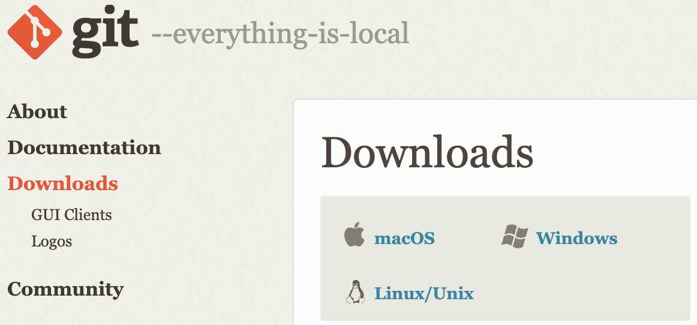
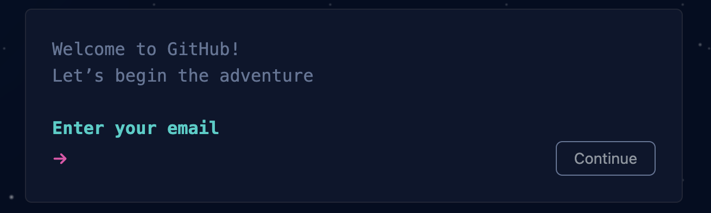
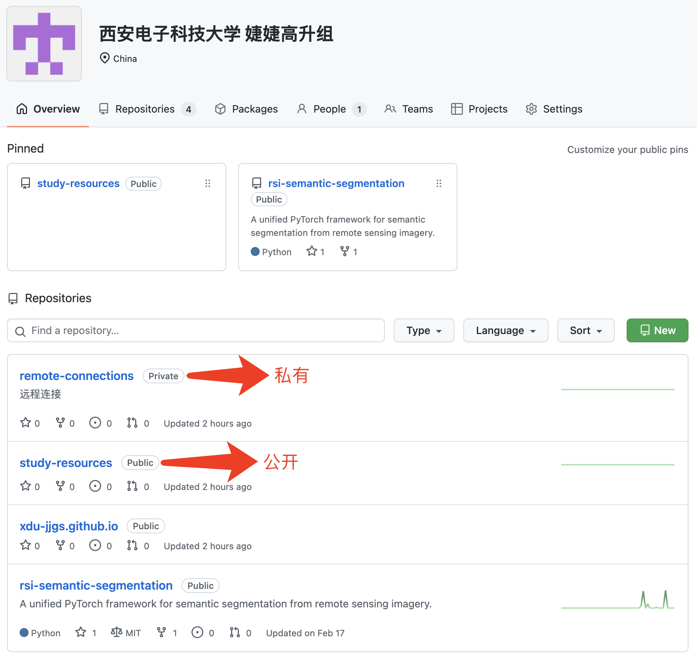
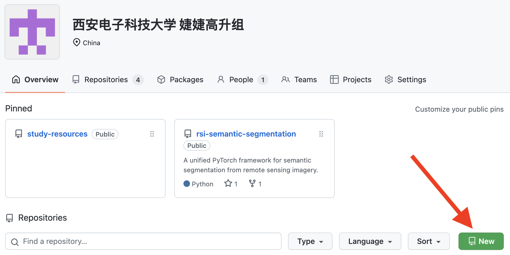
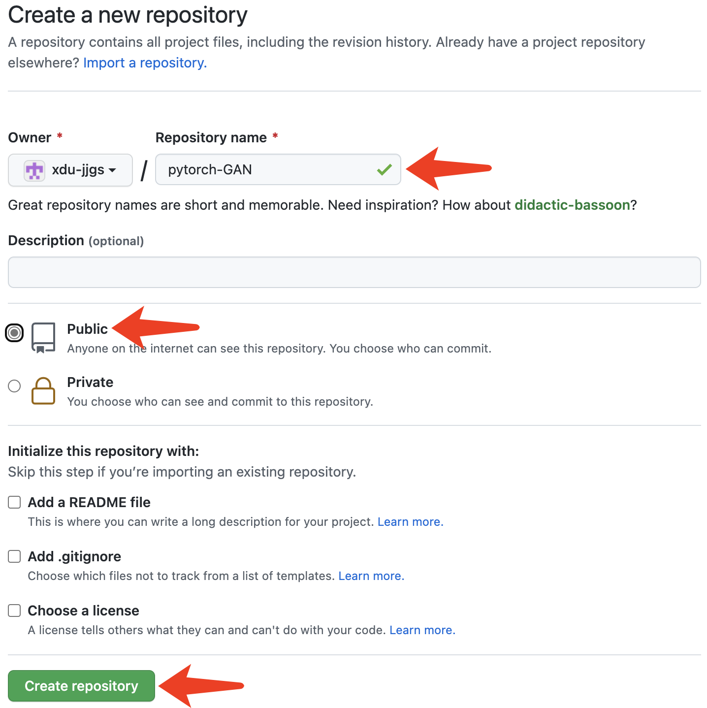
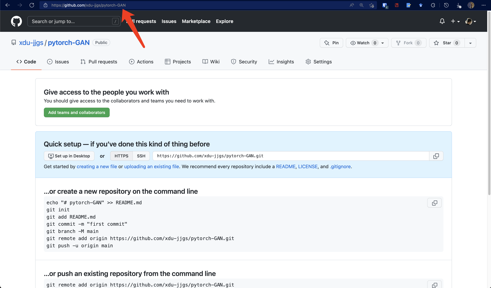
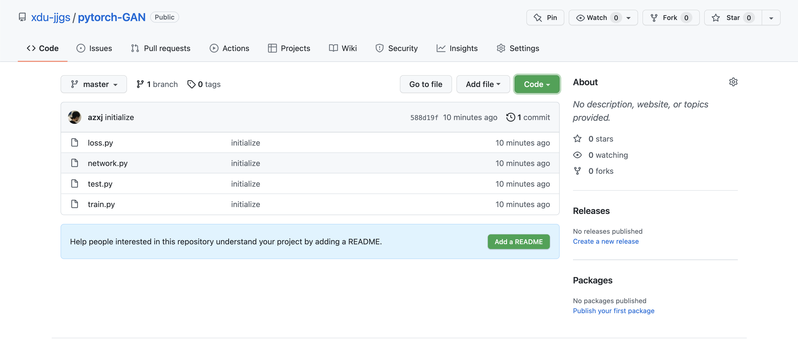
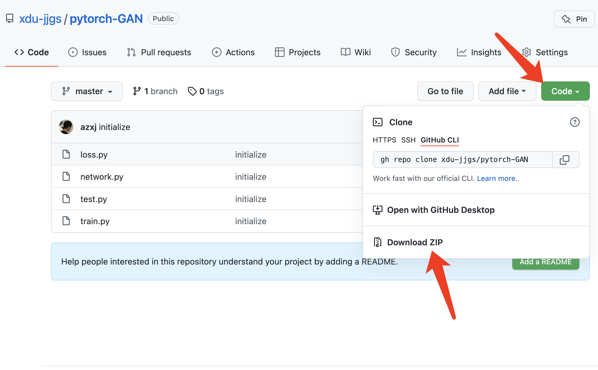

# GitHub 使用指南

## 目录

- [1. 你需要安装 Git 这个软件](#install-git)
    - [1.1. 如果你用 Windows](#install-git-on-windows)
    - [1.2. 如果你用 Mac OS](#install-git-on-macos)
    - [1.3. 如果你用 Linux](#install-git-on-linux)
- [2. 你需要有一个 GitHub 账号](#create-account)
- [3. 访问实验室主页](#visit-homepage)
- [4. 我想新建一个仓库，把我本地的代码传上去，怎么做？](#create-repository)
- [5. 我对主页里某份代码感兴趣，想下载到本地，怎么做？](#download-repository)
- [附录：命令解释](#appendix-command-explanation)
- [附录：其他资源](#other-resources)

## <a name="install-git"></a>1. 你需要安装 Git 这个软件

### <a name="install-git-on-windows"></a>1.1. 如果你用 Windows

直接在 [Git 官网](https://git-scm.com/)上下载安装包进行安装即可。如果你访问不了这个网站，可以使用[这个现成的安装包](./assets/Git-2.35.1.2-64-bit.exe)。

### <a name="install-git-on-macos"></a>1.2. 如果你用 Mac OS

可以使用 [homebrew](https://brew.sh/) 安装：`brew install git`，或使用 [MacPorts](https://www.macports.org/) 安装：`sudo port install git`。

### <a name="install-git-on-linux"></a>1.3. 如果你用 Linux

在 Ubuntu 上可以使用 `apt install git` 安装，在 CentOS 上可以使用 `yum install git` 安装。



## <a name="create-account"></a>2. 你需要有一个 GitHub 账号

在 [GitHub](https://github.com/signup) 上注册一个账号，注意这里输入的用户名是账号的唯一标识，一经确认就无法修改。



## <a name="visit-homepage"></a>3. 访问实验室主页

实验室主页是[西安电子科技大学 婕婕高升组](https://github.com/xdu-jjgs)。作为普通路人，你只能访问公开仓库（标识为 `public`）；在加入该组织后，你可以访问所有公开仓库与私有仓库（标识为 `private`），并对任意仓库都有最高权限（包括但不限于 `clone`、`pull`、`push`）。



## <a name="create-repository"></a>4. 我想新建一个仓库，把我本地的代码传上去，怎么做？

假设你本地的代码放在 `C:/Users/zxj/Documents/pytorch-GAN` 这个目录下：

1. 首先，在主页上点击 New 新建一个代码仓库：



2. 在 Repository name 处填入 `pytorch-GAN`，其他选项保持默认，点击 Create repository（如果这份代码可以在网上公开，你可以选择 Public）：



3. 创建完成后，浏览器将自动跳转到该代码仓库的页面，此时新建的是一个空仓库，里面什么也没有。记住该仓库的链接为 [https://github.com/xdu-jjgs/pytorch-GAN](https://github.com/xdu-jjgs/pytorch-GAN)：



4. 打开命令行，使用 `cd C:/Users/zxj/Documents/pytorch-GAN` 进入本地代码所在的目录，使用 `git init` 对该目录进行初始化，使用 `git add .` 将该目录下的所有代码文件加入到 Git 的暂存区中，使用 `git commit -m "initialize"` 将暂存区中的文件提交到 Git 的本地仓库中：

```shell
$ cd C:/Users/zxj/Documents/pytorch-GAN
$ git init
Initialized empty Git repository in /Users/zxj/Codes/pytorch-GAN/.git/
$ git add .
$ git commit -m "initialize"
[master (root-commit) 588d19f] initialize
 4 files changed, 0 insertions(+), 0 deletions(-)
 create mode 100644 loss.py
 create mode 100644 network.py
 create mode 100644 test.py
 create mode 100644 train.py
```

7. 使用 `git remote add origin https://github.com/xdu-jjgs/pytorch-GAN` 将本地仓库与远程仓库关联在一起，使用 `git push -u origin master` 将本地仓库里的内容上传到远程仓库：

```shell
$ git remote add origin https://github.com/xdu-jjgs/pytorch-GAN
$ git push -u origin master
Enumerating objects: 3, done.
Counting objects: 100% (3/3), done.
Delta compression using up to 12 threads
Compressing objects: 100% (2/2), done.
Writing objects: 100% (3/3), 233 bytes | 233.00 KiB/s, done.
Total 3 (delta 0), reused 0 (delta 0), pack-reused 0
To https://github.com/xdu-jjgs/pytorch-GAN
 * [new branch]      master -> master
Branch 'master' set up to track remote branch 'master' from 'origin'.
```
8.如果你clone下来一个别人的仓库，在此基础上完成你的代码，推送到自己的仓库可能遇到如下问题：  
error: remote origin already exists.表示远程仓库已存在。  
```shell
因此你要进行以下操作：  
1、先输入git remote rm origin 删除关联的origin的远程库  
2、关联自己的仓库 git remote add origin https://gitee.com/xxxxxx.git  
3、最后git push origin master，这样就推送到自己的仓库了。  
```


## <a name="download-repository"></a>5. 我对主页里某份代码感兴趣，想下载到本地，怎么做？

假设你感兴趣的代码链接为 [https://github.com/xdu-jjgs/pytorch-GAN](https://github.com/xdu-jjgs/pytorch-GAN)，有两种方法下载代码：

- 第一种方法：在命令行使用 `git clone https://github.com/xdu-jjgs/pytorch-GAN` 下载：

```shell
$ git clone https://github.com/xdu-jjgs/pytorch-GAN
Cloning into 'pytorch-GAN'...
remote: Enumerating objects: 3, done.
remote: Counting objects: 100% (3/3), done.
remote: Compressing objects: 100% (2/2), done.
remote: Total 3 (delta 0), reused 3 (delta 0), pack-reused 0
Receiving objects: 100% (3/3), done.
```

- 第二种方法：直接在仓库页面点击 Download ZIP 下载：



## <a name="appendix-command-explanation"></a>附录：命令解释

Git 仓库分为远程仓库与本地仓库，远程仓库放在 GitHub、Gitee 等网站上，本地仓库放在本地电脑中。对于本地的一个代码文件夹而言，存在工作区（workspace）、暂存区（index）和仓库（repository）这三个空间，代码默认都放在工作区中，经过 `git add` 会被添加到暂存区中，经过 `git commit` 会被提交到仓库中，经过 `git push` 就可以将本地仓库里的东西上传到远程，关系如下图所示：


- `git init`：在一个本地目录中初始化 Git 仓库，该目录下会新增一个 `.git/` 文件夹，用于记录与 Git 有关的信息
- `git add <file>`：将文件从工作区添加到暂存区
- `git commit -m <message>`：将文件从暂存区提交到本地仓库，附带一条消息，表示本次提交新增 / 修改了哪些内容
- `git push`：将本地仓库里提交的东西上传到远程仓库，这样其他人就可以看到你修改过的内容
- `git clone`：将一个远程仓库下载到本地，成为本地仓库

## <a name="other-resources"></a>资源

更进一步学习 Git 分支、Git 标签等高级内容，可以参考[廖雪峰的 Git 教程](https://www.liaoxuefeng.com/wiki/896043488029600)。
